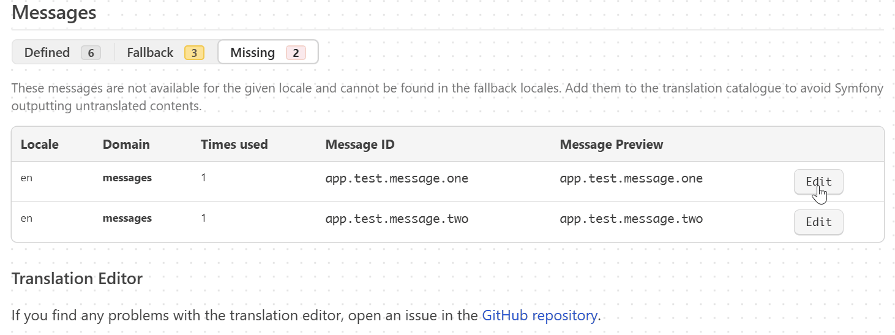

# Profiler Translation Editor Bundle

This bundle provides a way to edit the translations of your Symfony application directly from the Symfony profiler.





This bundle is inspired by the [php-translation/symfony-bundle](https://github.com/php-translation/symfony-bundle), which
offers a similar feature, but has more dependencies and is more complex to use. This bundle provides a simpler and more
modern alternative to this, which supports the latest Symfony versions and slightly faster.

## Requirements

* PHP 8.1 or higher
* Symfony 6.4 or higher (compatible with Symfony 7)

## Installation

You can install this bundle using composer:

```bash
composer require --dev jbtronics/translation-editor-bundle
```

Note the `--dev` flag, as this bundle is only intended for development and debugging purposes.

If you are using Symfony Flex, the bundle will be automatically enabled. If not, you have to enable it manually in your
`config/bundles.php`:

```php
return [
    // ...
    Jbtronics\SettingsBundle\JbtronicsSettingsBundle::class => ['dev' => true],
];
```
Please note that this bundle should only be enabled in the `dev` environment.

You also need to enable the required routes for your bundle. You can do this by creating a new file in your `config/routes`
directory (e.g. `config/routes/jbtronics_translation_editor.yaml`):

```yaml
# config/routes/jbtronics_translation_editor.yaml

when@dev:
    translation_editor:
      resource: '@JbtronicsTranslationEditorBundle/config/routes.php'
```

## Configuration

If you do not use the standard paths for your translation files, or not the XLF format, you have to configure the bundle
to generate the right files. If you just use the standard paths and XLF format, the defaults should be fine for you, and
you can skip this step and you do not need to create a configuration file.

Otherwise create a new file in your `config/packages` directory (e.g. `config/packages/jbtronics_translation_editor.yaml`)
and configure the options you need (here the default values are shown):

```yaml
# config/packages/jbtronics_translation_editor.yaml

jbtronics_translation_editor:

  # The path where the translation files are stored (normally %kernel.project_dir%/translations)
  translations_path: "%translator.default_path%"
  
  # The format in which the translation files should be outputted
  format: yaml
  
  # The version of the XLIFF format to use
  xliff_version: 2.0
  
  # Any additional options that should be passed to the translation writer. This depends on the format you use.
  writer_options:
    #as_tree: true
```

## Usage

After you have installed and configured the bundle, just open the Symfony profiler for the request you want the
translations to edit. In the table with the messages, you will see a new column with an edit button. Click on this
button to open a editor for the message and click save to save the changes.

After submission the field is colored blue, while the changes are saved. If the changes were saved sucessfully, the field
will turn green for a short time, otherwise red if an error occurred.

## Security

The endpoint for the translation editor is not protected. Anybody who can access the web application and the profiler can
edit the translations, with all consequences. As translations are not necessarily translated, this could allow attackers
to inject malicious code as an XSS attack.

However, this bundle, similar to the Symfony profiler itself, is only intended for development and debugging purposes and
should only run in a dedicated development environment, where only trusted users have access (and could modify the code 
directly anyway). Therefore, the security risk should be minimal in the intended use case.

This bundle enforces the `dev` environment, so it should not be possible to use it in a production environment. Anyway,
you should make sure that the bundle and especially the translation editor endpoint must not be accessible in a production
environment.

## License

SettingsBundle is licensed under the MIT License.
This mostly means that you can use this bundle for whatever you want (even use it commercially)
as long as you retain the copyright/license information.

See [LICENSE](https://github.com/jbtronics/translation-editor-bundle/blob/master/LICENSE) for more information.
